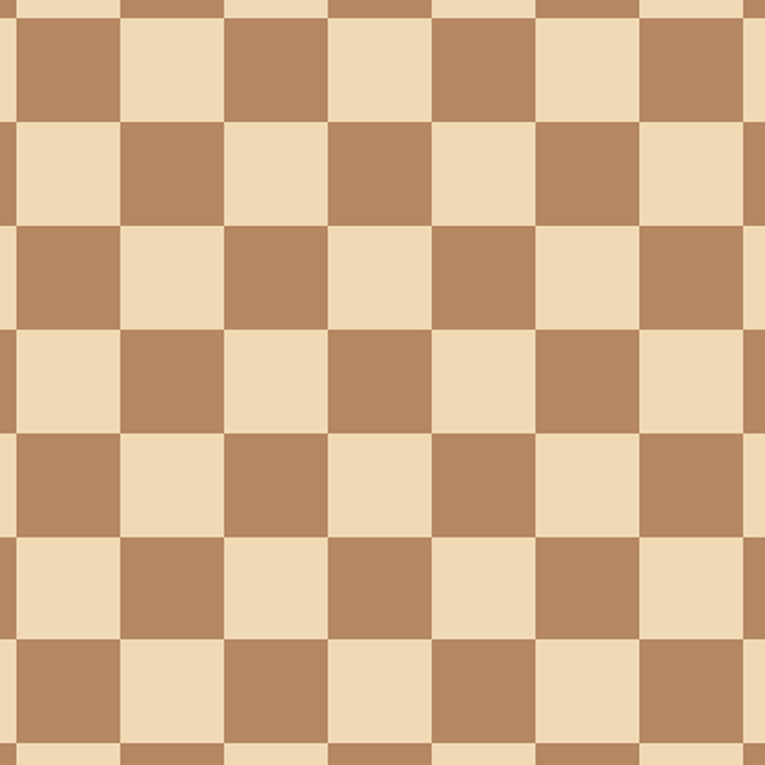
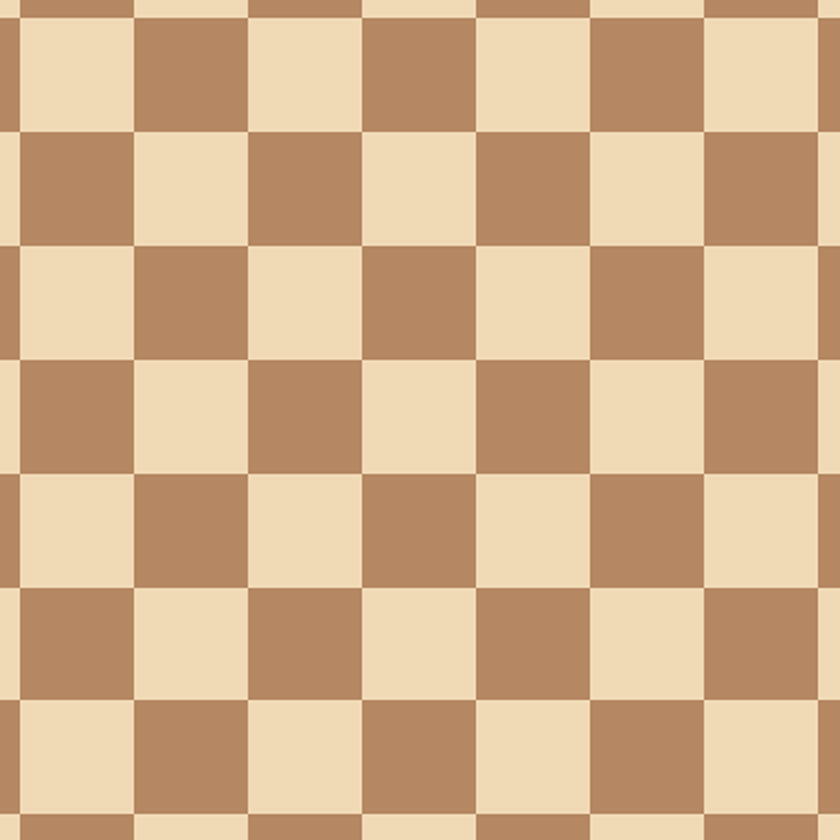
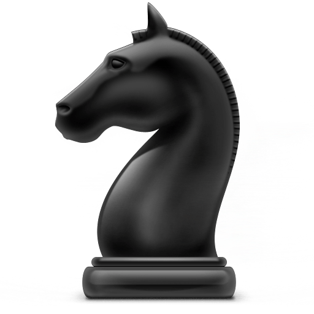

# Knight Dance

This game was designed to be focused around the knight from chess. Having the most unique movement, I thought it would be fun to allow players to experience playing solely as a knight, escaping capture from the other minor and major pieces.

This game was created using HTML, CSS, and JavaScript. The earliest stages began by inputing a chessboard-like grid onto the JavaScript canvas element. From there, I experimented with different types of key-binds for moving the knight sprite around.

Originally, I wanted to make a more exploratory game where the knight searches an oversized chessboard for a king, evading capture from the opposite side's pieces. The game morphed into a survival based game, which allowed a more action based game (more key presses by the player, sometimes frantically trying to evade multiple pieces at once).

From there, I added the bishop, rook, and queen. Their movements were orthagonal, so I chose to make the queen a bit faster to show her power on the board. The rooks move left and right (originally I had more going up and down, but it was overwhelming). The bishops move on their diagonals.

The main functions were using hit detect to reset computer pieces hitting eachother, as well as the player hit detect to end the game and give the player their final score.


# Wire-frame for initial ideas:


# JavaScript
| Functions  | Description |
| ------------- | ------------- |
| readyToPlay()  |  Starts game and begins gameLoop function  |
| gameLoop()  |  Runs the main portion of the game, once DOM content is loaded and the start button has been clicked  |
| scoreUp()  |  Continuously accumulates a score until the player's knight is captured  |
| movementHandler(e)  |  Allows players to use keyboard to move the knight  |
| detectHit()  | Determines when the player is hit by an enemy, and loses  |
| detectFriendlyFire()  |  Determines if enemy pieces collides, and resets one of their positions  |
| endGame()  |  Once detectHit triggers, the score stops counting, and lets the player know what captured them  |

|  Classes  |  Description  |
| ------------- | ------------- |
|  Player  |  The player controlled knight  |
|  Opponent  |  Bishops, rooks, and queens  |
|  BackgroundImg  |  The start menu, game board, and game over screens  |
|  Sound  |  The start game sound, moving sound, and game over sound  |

# app.js
```// -------------- GLOBAL DOM / VARIABLES ------ //
const map = document.querySelector('.map');
const movement = document.getElementById('movement');
const canvas = document.getElementById('canvas');
const score = document.getElementById('score');
const ctx = canvas.getContext('2d'); //creates a 2D canvas
const beginClick = document.getElementById('btm-right');
const playAgain = document.getElementById('retry');
let lastMove = new Date().getTime();
let lastQueen = new Date().getTime();
let startClick = false;
let captureByR = false;
let captureByB = false;
let captureByQ = false;
let knight;
let rook1, rook2, rook3, rook4, rook5, rook6, rook7, rookA, rookB, rookC, rookD, rookE, rookF, rookG;
let bishop1, bishop2, bishop3, bishop4, bishop5, bishop6;
let queen1, queen2, queen3, queen4;
let scoreTimer;

// ---------------- Images -------------------  //
const kPiece = document.getElementById('kPiece');
const bgBlack = document.getElementById('bgBlack');
const bgWhite = document.getElementById('bgWhite');
const startMenuImg = document.getElementById('help');
const wRook = document.getElementById('wRook');
const wBishop = document.getElementById('wBishop');
const wQueen = document.getElementById('wQueen');
const capByR = document.getElementById('capByR');
const capByB = document.getElementById('capByB');
const capByQ = document.getElementById('capByQ');

// ---------------- Sounds -------------------  //


// ---------------- EVENT LISTENERS ----------  //
window.addEventListener('DOMContentLoaded', function() {

    // const beginGame = setInterval(startGame, 60); OLD START
    const rungame = setInterval(gameLoop, 60);
});

// ---------------- Canvas Rendering ----------  //
canvas.width = 840;
canvas.height = 840;

// ---------------- Buttons -------------------  //
document.getElementById('btm-right').onmousedown = function() {
    document.getElementById('btm-right').style.color = 'rgb(44, 77, 114)';
    document.getElementById('btm-right').style.backgroundColor = 'rgba(210, 177, 140, .15)';
}
document.getElementById('btm-right').onmouseleave = function() {
    document.getElementById('btm-right').style.color = 'rgb(210, 177, 140)';
    document.getElementById('btm-right').style.backgroundColor = 'rgba(210, 177, 140, .25)';
}
document.getElementById('retry').onmousedown = function() {
    document.getElementById('retry').style.color = 'rgb(44, 77, 114)';
    document.getElementById('retry').style.backgroundColor = 'rgba(210, 177, 140, .15)';
    location.reload();
}

// ---------------- Entities ------------------  //


class Player {
    constructor(x, y, image, width, height) {
        this.x = x,
        this.y = y
        this.width = width
        this.height = height
        this.image = image;
        this.alive = true;

        this.render = function() {
            ctx.drawImage(this.image, this.x, this.y, this.width, this.height)
        }
    }
}

const gravity = 1.5;

class Opponent {
    constructor(x, y, image, width, height, type, name) {
        this.x = x;
        this.y = y;
        this.initialx = x;
        this.initialy = y;
        this.width = width
        this.height = height
        this.image = image;
        this.type = type;
        this.name = name;
        this.direction = 114;

        this.render = function() {
            ctx.drawImage(this.image, this.x, this.y, this.width, this.height);
        }

        this.move = function() {
            requestAnimationFrame(() => {
                if(this.type === 'right'){
                    if(this.x < 1000) {
                        this.x += this.direction;
                        } else {
                        this.x = x;
                        }
                    } 
                    if(this.type === 'left'){
                        if(this.x > -500) {
                            this.x -= this.direction;
                        } else {
                            this.x = x;
                        }
                    } 
                    if(this.type === 'diagrd'){
                        if(this.x < 1000) {
                            this.x += this.direction;
                            this.y += this.direction;
                        } else {
                            this.x = x;
                            this.y = y;
                        }
                    }
                    if(this.type === 'diagru'){
                        if(this.x < 1000) {
                            this.x += this.direction;
                            this.y -= this.direction;
                        } else {
                            this.x = x;
                            this.y = y;
                        }
                    }
                    if(this.type === 'diagld'){
                        if(this.x > -500) {
                            this.x -= this.direction;
                            this.y += this.direction;
                        } else {
                            this.x = x;
                            this.y = y;
                        }
                    }
                    if(this.type === 'diaglu'){
                        if(this.x > -500) {
                            this.x -= this.direction;
                            this.y -= this.direction;
                        } else {
                            this.x = x;
                            this.y = y;
                        }
                    }
                    if(this.type === 'down'){
                        if(this.y < 1000) {
                            this.y += this.direction;
                        } else {
                            this.x = x;
                            this.y = y;
                        }
                    }
                    if(this.type === 'up'){
                        if(this.y > -50) {
                            this.y -= this.direction;
                        } else {
                            this.x = x;
                            this.y = y;
                        }
                    }
        })
        }
    }
}


class BackgroundImg {
    constructor(x, y, image, width, height) {
        this.x = x,
        this.y = y
        this.width = width
        this.height = height
        this.image = image;

        this.render = function() {
            ctx.drawImage(this.image, this.x, this.y, this.width, this.height)
        }
    }
}

class Sound {
    constructor(src) {
        this.sound = document.createElement('audio');
        this.sound.src = src;
        this.sound.setAttribute('preload', 'auto');
        this.sound.setAttribute('controls', 'none');
        this.sound.style.display = 'none';
        document.body.appendChild(this.sound);
        this.play = function () {
            this.sound.play();
        };
        this.stop = function () {
            this.sound.pause();
        };
    }
}

// Main player
knight = new Player(365, 370, kPiece, 100, 100);

// Sounds
wood = new Sound('wood.wav');
tromb = new Sound('tromb.wav');
startSound = new Sound('start.wav');
// retrySound = new Sound('retry.wav');

// Backgrounds
bgBlacksquare = new BackgroundImg(0, 0, bgBlack, 840, 840);
bgWhitesquare = new BackgroundImg(0, 0, bgWhite, 840, 840);
bgStartMenu = new BackgroundImg(0, 0, startMenuImg, 840, 840);
captureRLoss = new BackgroundImg(0, 0, capByR, 840, 840);
captureBLoss = new BackgroundImg(0, 0, capByB, 840, 840);
captureQLoss = new BackgroundImg(0, 0, capByQ, 840, 840);

// Enemy pieces
rook1 = new Opponent(-529, 721, wRook, 65, 80, 'right', 'rook');
rook2 = new Opponent(-187, 607, wRook, 65, 80, 'right', 'rook');
rook3 = new Opponent(1067, 493, wRook, 65, 80, 'left', 'rook');
rook4 = new Opponent(-985, 379, wRook, 65, 80, 'right', 'rook');
rook5 = new Opponent(1295, 265, wRook, 65, 80, 'left', 'rook');
rook6 = new Opponent(1523, 151, wRook, 65, 80, 'left', 'rook');
rook7 = new Opponent(-415, 37, wRook, 65, 80, 'right', 'rook');
bishop1 = new Opponent (-305, -423, wBishop, 70, 90, 'diagrd', 'bishop');
bishop2 = new Opponent (-420, -761, wBishop, 70, 90, 'diagrd', 'bishop');
bishop3 = new Opponent (-77, 717, wBishop, 70, 90, 'diagru', 'bishop');
bishop4 = new Opponent (1177, -309, wBishop, 70, 90, 'diagld', 'bishop');
bishop5 = new Opponent (1177, -651, wBishop, 70, 90, 'diagld', 'bishop');
bishop6 = new Opponent (1800, 1800, wBishop, 70, 90, 'diaglu', 'bishop');
queen1 = new Opponent (-536, 1282, wQueen, 80, 100, 'diagru', 'queen');
queen2 = new Opponent (832, 826, wQueen, 80, 100, 'diaglu', 'queen');
queen3 = new Opponent (262, 28, wQueen, 80, 100, 'down', 'queen');
queen4 = new Opponent (604, 940, wQueen, 80, 100, 'up', 'queen');

// All enemies array
let minorArray = [rook1, rook2, rook3, rook4, rook5, rook6, rook7, bishop1, bishop2, bishop3, bishop4, bishop5, bishop6]
let queenArray = [queen1, queen2, queen3, queen4]

// ---------------- Player Movement ----- //
function movementHandler(e) { // e just means event (what keydown recognizes)
    // console.log('movement', e.key)

    switch(e.key) {
        case 'r': 
            // keys.e.pressed = true;
            if (knight.x < 590 && knight.y > 35) {
                knight.x += 228;
                knight.y -= 114;
                wood.play();
            } // solved
            // knight.x < 590 ? (knight.x += 228) : null;
            // knight.y > 252 ? (knight.y -= 114) : null;
                break;
        case 'f': 
            // keys.d.pressed = true;
            if (knight.x < 590 && knight.y < 705) {
                knight.x += 228;
                knight.y += 114;
                wood.play();
            } // solved
            // knight.x < 590 ? (knight.x += 228) : null;
            // knight.y < 478 ? (knight.y += 114) : null;
                break;
        case 'd': 
            // keys.c.pressed = true;
            if (knight.x < 700 && knight.y < 595) {
                knight.x += 114;
                knight.y += 228;
                wood.play();
            } // solved
            // knight.x += 114;
            // knight.y += 228;
                break;
        case 's': 
            // keys.x.pressed = true;
            if (knight.x > 130 && knight.y < 595) {
                knight.x -= 114;
                knight.y += 228;
                wood.play();
            } // solved
            // knight.x -= 114;
            // knight.y += 228;
                break;
        case 'a': 
            // keys.s.pressed = true;
            if (knight.x > 250 && knight.y < 705 ) {
                knight.x -= 228;
                knight.y += 114;
                wood.play();
            } // solved
            // knight.x -= 228;
            // knight.y += 114;
                break;
        case 'q': 
            // keys.w.pressed = true;
            if (knight.x > 250 && knight.y > 35) {
                knight.x -= 228;
                knight.y -= 114;
                wood.play();
            } // solved
            // knight.x -= 228;
            // knight.y -= 114;
                break;
        case 'w': 
            // keys.2.pressed = true;
            if (knight.x > 30 && knight.y > 145) {
                knight.x -= 114;
                knight.y -= 228;
                wood.play();
            } // solved
            // knight.x -= 114;
            // knight.y -= 228;
                break;
        case 'e': 
            // keys.3.pressed = true;
            if (knight.x < 700 && knight.y > 145) {
                knight.x += 114;
                knight.y -= 228;
                wood.play();
            } // solved
            // knight.x += 114;
            // knight.y -= 228;
                break;
    }
    
}
// ---------------- Hit Test ------------- //
function detectHit(player, computer) {
    let hitTest = 
        player.y + player.height > computer.y && 
        player.y < computer.y + computer.height && // BOOLEAN
        player.x + player.width > computer.x &&  // CONDITION
        player.x < computer.x + computer.width;

        if (hitTest) {
            setTimeout(gameLoop, 0);
            // console.log(whoTook())
            if (computer.name === 'rook') {
                captureByR = true;
                tromb.play();
            } else if (computer.name === 'bishop') {
                captureByB = true;
                tromb.play();
            } else {
                captureByQ = true;
                tromb.play();
            }
        }

}


function detectFriendlyFire(player, computer) {
    let hitTest = 
        player.y + player.height > computer.y && 
        player.y < computer.y + computer.height && // BOOLEAN
        player.x + player.width > computer.x &&  // CONDITION
        player.x < computer.x + computer.width;

        if (hitTest) {
            computer.x = computer.intialx;
            computer.y = computer.initialy;
        }

}

// ---------------- Game Functions ------- //


// Function to increase score until failure
function scoreUp() {
    let addingScore = Number(score.textContent) + 1;
    score.textContent = addingScore;
}

// Function to remove start-guide and begin game
beginClick.addEventListener('click', function readyToPlay() {
    // debugger;
    startClick = true;
    // console.log(startClick);
    scoreTimer = setInterval(scoreUp, 400);
    startSound.play();
}) 

function endGame() {
    if(captureByR === true) {
        captureRLoss.render();
        document.getElementById('retry').style.display = 'flex';
        clearInterval(scoreTimer);
    } else if (captureByB === true) {
        captureBLoss.render();
        document.getElementById('retry').style.display = 'flex';
        clearInterval(scoreTimer);
    } else if (captureByQ === true) {
        captureQLoss.render();
        document.getElementById('retry').style.display = 'flex';
        clearInterval(scoreTimer);
    }
}

// Main game loop
function gameLoop() {
    // Call window.requestAnimationFrame() and pass in animate to refresh the canvas constantly
    window.requestAnimationFrame(gameLoop)
    bgStartMenu.render();
    if (startClick === true) {
        if (!captureByB && !captureByR && !captureByQ){
        document.addEventListener('keydown', movementHandler); // listen for movement
        // bgWhitesquare.render();
        bgBlacksquare.render();
        knight.render();
        const currentTime = new Date().getTime();
        if (lastMove + 1200 < currentTime) { // Bishop and rook speed
            minorArray.forEach((opponent) => { 
                opponent.move();
            })
            lastMove = currentTime;
        }
        if (lastQueen + 800 < currentTime) { // Queen speed
            queenArray.forEach((opponent) => {
                opponent.move();
            })
            lastQueen = currentTime;
        }
        
        //spawning pieces
        rook1.render(), rook2.render(), rook3.render(), rook4.render(), rook5.render(), rook6.render(), rook7.render();
        bishop1.render(), bishop2.render(), bishop3.render(), bishop4.render(), bishop5.render(), bishop6.render();
        queen1.render(), queen2.render(), queen3.render(), queen4.render();

        //hit detect with player
        let captureR1 = detectHit(knight, rook1);
        let captureR2 = detectHit(knight, rook2);
        let captureR3 = detectHit(knight, rook3);
        let captureR4 = detectHit(knight, rook4);
        let captureR5 = detectHit(knight, rook5);
        let captureR6 = detectHit(knight, rook6);
        let captureR7 = detectHit(knight, rook7);
        let captureB1 = detectHit(knight, bishop1);
        let captureB2 = detectHit(knight, bishop2);
        let captureB3 = detectHit(knight, bishop3);
        let captureB4 = detectHit(knight, bishop4);
        let captureB5 = detectHit(knight, bishop5);
        let captureB6 = detectHit(knight, bishop6);
        let captureQ1 = detectHit(knight, queen1);
        let captureQ2 = detectHit(knight, queen2);
        let captureQ3 = detectHit(knight, queen3);
        let captureQ4 = detectHit(knight, queen4);

        //hit detect between enemies
        let ff1 = detectFriendlyFire(rook1, bishop1);
        let ff2 = detectFriendlyFire(rook1, bishop2);
        let ff3 = detectFriendlyFire(rook1, bishop3);
        let ff4 = detectFriendlyFire(rook1, bishop4);
        let ff5 = detectFriendlyFire(rook1, bishop5);
        let ff6 = detectFriendlyFire(rook1, bishop6);
        let ff7 = detectFriendlyFire(rook1, queen1);
        let ff8 = detectFriendlyFire(rook1, queen2);
        let ff9 = detectFriendlyFire(rook1, queen3);
        let ff10 = detectFriendlyFire(rook2, queen4);
        let ff11 = detectFriendlyFire(rook2, bishop1);
        let ff12 = detectFriendlyFire(rook2, bishop2);
        let ff13 = detectFriendlyFire(rook2, bishop3);
        let ff14 = detectFriendlyFire(rook2, bishop4);
        let ff15 = detectFriendlyFire(rook2, bishop5);
        let ff16 = detectFriendlyFire(rook2, bishop6);
        let ff17 = detectFriendlyFire(rook2, queen1);
        let ff18 = detectFriendlyFire(rook2, queen2);
        let ff19 = detectFriendlyFire(rook2, queen3);
        let ff20 = detectFriendlyFire(rook2, queen4);
        let ff21 = detectFriendlyFire(rook3, bishop1);
        let ff22 = detectFriendlyFire(rook3, bishop2);
        let ff23 = detectFriendlyFire(rook3, bishop3);
        let ff24 = detectFriendlyFire(rook3, bishop4);
        let ff25 = detectFriendlyFire(rook3, bishop5);
        let ff26 = detectFriendlyFire(rook3, bishop6);
        let ff27 = detectFriendlyFire(rook3, queen1);
        let ff28 = detectFriendlyFire(rook3, queen2);
        let ff29 = detectFriendlyFire(rook3, queen3);
        let ff30 = detectFriendlyFire(rook3, queen4);
        let ff31 = detectFriendlyFire(rook4, bishop1);
        let ff32 = detectFriendlyFire(rook4, bishop2);
        let ff33 = detectFriendlyFire(rook4, bishop3);
        let ff34 = detectFriendlyFire(rook4, bishop4);
        let ff35 = detectFriendlyFire(rook4, bishop5);
        let ff36 = detectFriendlyFire(rook4, bishop6);
        let ff37 = detectFriendlyFire(rook4, queen1);
        let ff38 = detectFriendlyFire(rook4, queen2);
        let ff39 = detectFriendlyFire(rook4, queen3);
        let ff40 = detectFriendlyFire(rook4, queen4);
        let ff41 = detectFriendlyFire(rook5, bishop1);
        let ff42 = detectFriendlyFire(rook5, bishop2);
        let ff43 = detectFriendlyFire(rook5, bishop3);
        let ff44 = detectFriendlyFire(rook5, bishop4);
        let ff45 = detectFriendlyFire(rook5, bishop5);
        let ff46 = detectFriendlyFire(rook5, bishop6);
        let ff47 = detectFriendlyFire(rook5, queen1);
        let ff48 = detectFriendlyFire(rook5, queen2);
        let ff49 = detectFriendlyFire(rook5, queen3);
        let ff50 = detectFriendlyFire(rook5, queen4);
        let ff51 = detectFriendlyFire(rook6, bishop1);
        let ff52 = detectFriendlyFire(rook6, bishop2);
        let ff53 = detectFriendlyFire(rook6, bishop3);
        let ff54 = detectFriendlyFire(rook6, bishop4);
        let ff55 = detectFriendlyFire(rook6, bishop5);
        let ff56 = detectFriendlyFire(rook6, bishop6);
        let ff57 = detectFriendlyFire(rook6, queen1);
        let ff58 = detectFriendlyFire(rook6, queen2);
        let ff59 = detectFriendlyFire(rook6, queen3);
        let ff60 = detectFriendlyFire(rook6, queen4);
        let ff61 = detectFriendlyFire(rook7, bishop1);
        let ff62 = detectFriendlyFire(rook7, bishop2);
        let ff63 = detectFriendlyFire(rook7, bishop3);
        let ff64 = detectFriendlyFire(rook7, bishop4);
        let ff65 = detectFriendlyFire(rook7, bishop5);
        let ff66 = detectFriendlyFire(rook7, bishop6);
        let ff67 = detectFriendlyFire(rook7, queen1);
        let ff68 = detectFriendlyFire(rook7, queen2);
        let ff69 = detectFriendlyFire(rook7, queen3);
        let ff70 = detectFriendlyFire(rook7, queen4);
        let ff71 = detectFriendlyFire(bishop1, queen1);
        let ff72 = detectFriendlyFire(bishop1, queen2);
        let ff73 = detectFriendlyFire(bishop1, queen3);
        let ff74 = detectFriendlyFire(bishop1, queen4);
        let ff75 = detectFriendlyFire(bishop2, queen1);
        let ff76 = detectFriendlyFire(bishop2, queen2);
        let ff77 = detectFriendlyFire(bishop2, queen3);
        let ff78 = detectFriendlyFire(bishop2, queen4);
        let ff79 = detectFriendlyFire(bishop3, queen1);
        let ff80 = detectFriendlyFire(bishop3, queen2);
        let ff81 = detectFriendlyFire(bishop3, queen3);
        let ff82 = detectFriendlyFire(bishop3, queen4);
        let ff83 = detectFriendlyFire(bishop4, queen1);
        let ff84 = detectFriendlyFire(bishop4, queen2);
        let ff85 = detectFriendlyFire(bishop4, queen3);
        let ff86 = detectFriendlyFire(bishop4, queen4);
        let ff87 = detectFriendlyFire(bishop5, queen1);
        let ff88 = detectFriendlyFire(bishop5, queen2);
        let ff89 = detectFriendlyFire(bishop5, queen3);
        let ff90 = detectFriendlyFire(bishop5, queen4);
        let ff91 = detectFriendlyFire(bishop6, queen1);
        let ff92 = detectFriendlyFire(bishop6, queen2);
        let ff93 = detectFriendlyFire(bishop6, queen3);
        let ff94 = detectFriendlyFire(bishop6, queen4);
        
        } else {
        endGame();
        }
    }
    else {
        bgStartMenu.render();
    }
}


// ---------------- Unused Code ----------  //
// const keys = {
    //     2: {
    //         pressed: false
    //     },
    //     3: {
    //         pressed: false
    //     },
    //     w: {
    //         pressed: false
    //     },
    //     e: {
    //         pressed: false
    //     },
    //     s: {
    //         pressed: false
    //     },
    //     d: {
    //         pressed: false
    //     },
    //     x: {
    //         pressed: false
    //     },
    //     c: {
    //         pressed: false
    //     }
    // };

    // Old Menu image calling
    // guide.style.display = "none";
    // document.querySelector('body').removeChild(img);
// }
// function guideFunction() {
//     const popup = document.getElementById("myPopup");
//     popup.classList.toggle("show");
//   }


// Unnecessary start loop/function
// function startGame() {
//     if (startClick = false) {
//         // animateStartGame();
//         requestAnimationFrame(startGame);
//         bgStartMenu.render();
//     } else {
//         gameLoop();
//     }
// }

//Joel's math for sporadic movement.
//     } else if (this.type === 'diag') {
                //         this.x += moveArrayOrthag[Math.floor(Math.random()* 2)];
                //         this.y += moveArrayOrthag[Math.floor(Math.random()* 2)];
                //     } else if (this.type === 'omni') {
                //         this.x += moveArrayOrthag[Math.floor(Math.random()* 2)];

        // this.move = function() {
        //     requestAnimationFrame(() => {
        //         if(this.type === 'orthag'){
        //             if(Math.floor(Math.random()* 2) == 0) {
        //                 this.x += this.direction;
        //             } else {
        //                 this.y += this.direction;
        //             }
        //             } else if (this.type === 'diag') {
        //                 this.x += moveArrayOrthag[Math.floor(Math.random()* 2)];
        //                 this.y += moveArrayOrthag[Math.floor(Math.random()* 2)];
        //             } else if (this.type === 'omni') {
        //                 this.x += moveArrayOrthag[Math.floor(Math.random()* 2)];
        //         }
        //     } )
        // }


// Failed function to determine which piece captured the knight
// function whoTook() {
//     // debugger;
//     if (rook1.x = knight.x) {
//         captureByR = true;
//     } 
//     if (detectHit(knight, bishop1)){
//         captureByB = true;
//     }
//     if (detectHit(knight, queen1)){{
//         captureByQ = true;
//     }
// }
// }
```
# index.html
```
<!DOCTYPE html>
<html lang="en">
<head>
    <meta charset="UTF-8">
    <meta http-equiv="X-UA-Compatible" content="IE=edge">
    <meta name="viewport" content="width=device-width, initial-scale=1.0">
    <title>Knight Walker</title>
    <link rel="stylesheet" href="style.css">
</head>
<body>
    <div class="imageContainer">
      
      
      
      
      
      
      
      
      
      
      </div>
      <div id="container">
        <aside id="top-left"><h2>Knight Dance</h2></aside>
        <main>
            <canvas id="canvas"><!-- play it, a game --></canvas>
            <aside id="helpMenu" style="display:none">test</aside>
            
        </main>
        <aside id="btm-left"><h2 id="score">0</h2></aside>
        <button id="btm-right">Ready to Play?</button>
      </div>
      <button id="retry">Play Again?</button>
    <script src="app.js"></script>
</body>
</html>
```
# style.css
```
@import url('https://fonts.googleapis.com/css2?family=Merriweather:ital@1&display=swap');
@import url('https://fonts.googleapis.com/css2?family=Teko&display=swap');

html,body {
    margin: 0;
    padding: 0;
  }
  
  body {
    padding-top: 1em;
    text-align: center;
    background-image: url(./images/darkwood.jpg);
    background-size: 2600px 1500px;
    background-repeat: no-repeat;
  }
  
  h1, h2 {
    font-family: 'Merriweather', serif;
    font-size: 4em;;
    /* font-family: monospace; */
    color: rgb(210, 177, 140)
  }
  
  canvas {
    /* background-image: url(./images/KWBackground.png); */
    /* background-repeat: repeat; */
    background-color: #222;
    border: double black 5px;

    width: 700px;
    height: 700px;
    
  }
  
  #container {
  max-width: 50em;
  /* height: 70vh; */
  background-color: rgba(210, 177, 140, 0);
  justify-content: space-between;
  margin: 0 auto;
  padding: 1em;
  display: grid;
  grid-gap: 1em;
  /* grid-template-rows: .5fr .5fr; */
  grid-template-columns: .5fr .5fr;
  grid-template-areas: "top-left top-left"
                        "game game"
                        "btm-left btm-right";
  }
  
  #top-left, #top-right, #btm-left, #btm-right {
    display: flex;
    height: 100px;
    justify-content: center;
    align-items: center;
    background-color: rgba(210, 177, 140, .25);
    border: ridge rgb(46, 46, 46) 5px;
    /* border-radius: 25px; */
  }
  
  #retry {
    font-family: 'Merriweather', serif;
    color: rgb(210, 177, 140);
    font-size: 2em;
    margin: 0 auto;
    margin-left: 41%;
    padding: 0 40px;
    display: none;
    height: 100px;
    justify-content: center;
    align-items: center;
    background-color: rgba(210, 177, 140, .25);
    border: ridge rgb(46, 46, 46) 5px;
    cursor: pointer;
  }

  #top-left {
    grid-area: top-left;
    width: 824px;
  }
  
  #top-right {
    grid-area: top-right;
    /* background-color: #222; */
    /* background-image: url('../img/funky-lines.png'); */
  }
  
  main {
    grid-area: game;
  }
  
  
  #btm-left {
    grid-area: btm-left;
    /* margin-top: .8em; */
    height: 50px;
    /* background-color: #222; */
  }
  
  #btm-right {
    font-family: 'Merriweather', serif;
    color: rgb(210, 177, 140);
    font-size: 2em;
    grid-area: btm-right;
    /* margin-top: .8em; */
    height: 60px;
    /* background-color: #222; */
    cursor: pointer;
  }

  #score {
    font-family: 'Teko', sans-serif;
    font-size: 2.5em;
    padding-top: 8px;
  }
```
# Installation
1. Go to repository on Github my profile
2. Fork and clone the repository
3. Clone to your local machine
 ```git clone https://github.com/coreyimurphy91/knight-dance.git```
4. Go to the project directory
5. Open index.html in your prefered browser
